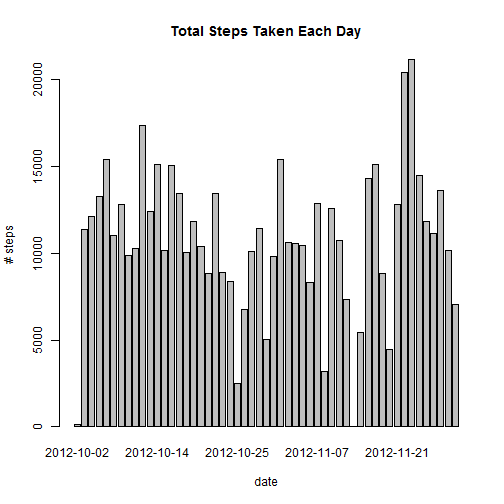
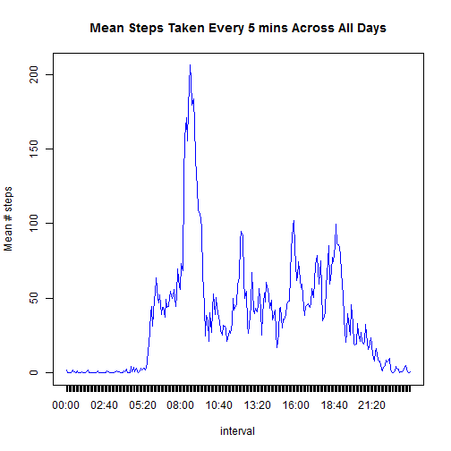
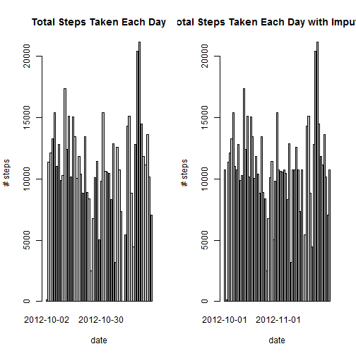
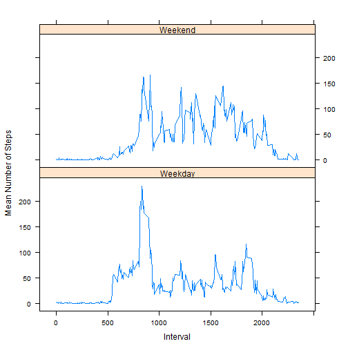

Set the directory where "activity.csv" file is kept


```r
setwd('D:\\Coursera\\Rpd_Rsrch')
```

1. Load the data (i.e. read.csv())

```r
dat = read.csv("activity.csv", header = TRUE)
```

2. Process/transform the data (if necessary) into a format suitable for your analysis. Here's processing of 'Date' and adding a 'time'column 

```r
dat$date <- as.Date(dat$date)
library(stringr)
dat$interval<-str_pad(dat$interval, 4, pad = "0")
dat_time<-strftime(strptime(dat$interval,"%H%M"),'%H:%M')
dat$time<-dat_time
```

Following figure shows a histogram of the total number of steps taken each day:

```r
sum_steps_datewise <- aggregate(steps~date,data=dat,FUN=sum, na.rm=TRUE)
barplot(height=sum_steps_datewise$steps, names.arg=sum_steps_datewise$date, xlab="date", ylab="# steps",main="Total Steps Taken Each Day")
```

 


Mean total number of steps taken per day is

```r
mean(sum_steps_datewise$steps)
```

```
## [1] 10766.19
```


Median of total number of steps taken per day is

```r
median(sum_steps_datewise$steps)
```

```
## [1] 10765
```

What is the average daily activity pattern?

A time series plot (i.e. type = "l") of the 5-minute interval (x-axis) and the average number of steps taken, averaged across all days (y-axis)


```r
dat$time <- as.factor(dat$time)
average_steps_timewise <- aggregate(steps~time,data=dat,FUN=mean, na.rm=TRUE)

plot(average_steps_timewise$steps, type="l", col="blue", xlab="interval", ylab="Mean # steps", main="Mean Steps Taken Every 5 mins Across All Days",xaxt="n")
axis(1, at=1:288, labels=average_steps_timewise$time)
```

 

5-minute interval, on average across all the days in the dataset, that contains the maximum number of steps is

```r
as.character(average_steps_timewise$time[which.max(average_steps_timewise$steps)])
```

```
## [1] "08:35"
```
and maximum number of average steps taken is

```r
max(average_steps_timewise$steps)
```

```
## [1] 206.1698
```

Total number of missing values in the dataset (i.e. the total number of rows with NAs) is

```r
nrow(dat[!complete.cases(dat),])
```

```
## [1] 2304
```

Devise a strategy for filling in all of the missing values in the dataset. The strategy does not need to be sophisticated.
Here, the mean for that 5-minute interval is used to impute the missing values

```r
library(plyr)
impute.mean <- function(x) replace(x, is.na(x), mean(x, na.rm = TRUE))
dat2 <- ddply(dat, ~ time, transform, steps = impute.mean(steps))
```

Following command is to form a new dataset that is equal to the original dataset but with the missing data filled in

```r
dat2<-dat2[order(dat2$date), ]
```

Here is a comparison of the  total number of steps taken each day with and without missing values using a histogram

```r
sum_steps_datewise <- aggregate(steps~date,data=dat,FUN=sum, na.rm=TRUE)
sum_steps_datewise_with_Imput_NAs <- aggregate(steps~date,data=dat2,FUN=sum, na.rm=TRUE)

par(mfrow=c(1,2))
barplot(height=sum_steps_datewise$steps, names.arg=sum_steps_datewise$date, xlab="date", ylab="# steps",main="Total Steps Taken Each Day")
barplot(height=sum_steps_datewise_with_Imput_NAs$steps, names.arg=sum_steps_datewise_with_Imput_NAs$date, xlab="date", ylab="# steps",main="Total Steps Taken Each Day with Imput_NAs")
```

 

Calculated mean and median total number of steps taken per day using imputed data:

```r
mean(sum_steps_datewise_with_Imput_NAs$steps)
```

```
## [1] 10766.19
```

```r
median(sum_steps_datewise_with_Imput_NAs$steps)
```

```
## [1] 10766.19
```

Thed above mean, median values and the comparative histogram suggests that the  impact of imputing missing data on the estimates of the total daily number of steps is not significant.

Following figure indicates that there are differences in activity patterns between weekdays and weekends
1) maximum number of average steps taken on weekend (~150) whereas on weekdays(>200)
2) There is more activity in the late evening on weekends as compared to weekdays


```r
dat2$day <- weekdays(as.Date(dat2$date))
dat2$day[dat2$day!="Saturday" & dat2$day!="Sunday"]<-"Weekday"
dat2$day[dat2$day=="Saturday" | dat2$day=="Sunday"]<-"Weekend"

dat2$day <- as.factor(dat2$day)

dat2$interval<-as.numeric(dat2$interval)
average_steps_day_and_intervalwise <- aggregate( steps ~ day + interval, data = dat2, mean)
library(lattice)
xyplot( steps~interval | day,  data=average_steps_day_and_intervalwise,type="l",layout=c(1,2),xlab="Interval", ylab="Mean Number of Steps")
```

 
 
